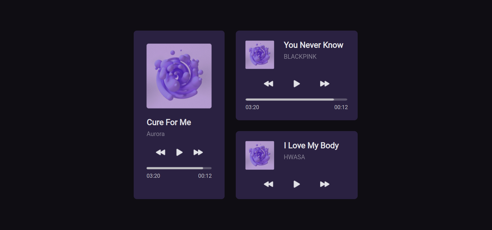

# Ui player Challenge Rocketseat

Desenvolver o player conforme especificado no layoute do [figma](https://www.figma.com/community/file/1195050524500542670/player-de-musica-desafio-01).

## Run project

In the project directory, you can run:

### `npm start`

Runs the app in the development mode.\
Open [http://localhost:3000](http://localhost:3000) to view it in your browser.

## Web view

